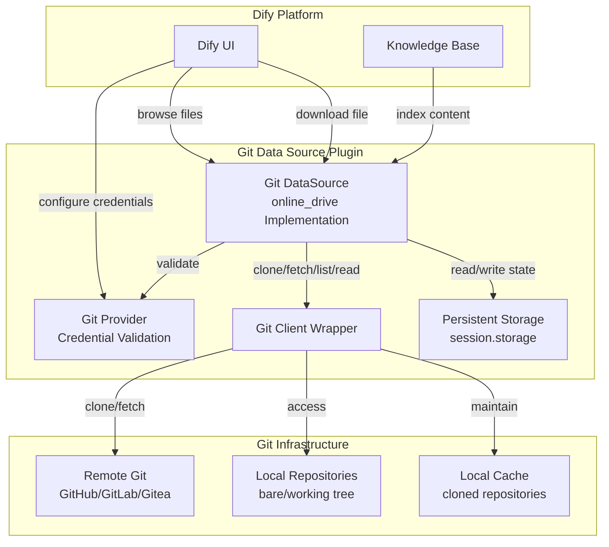
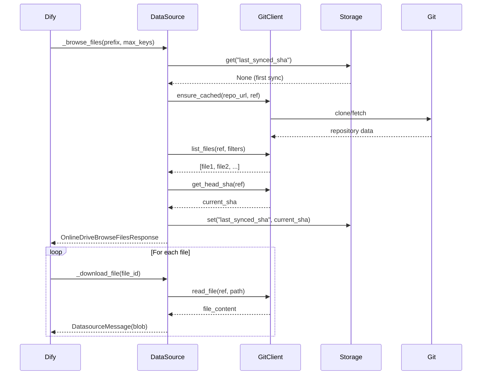
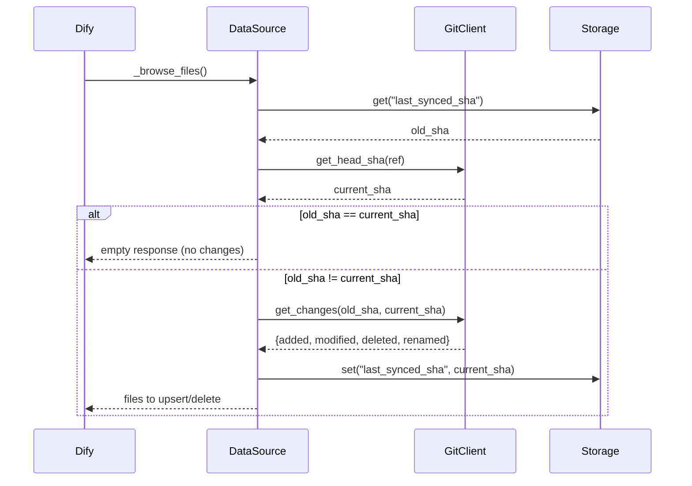
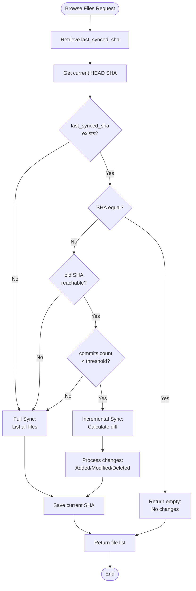
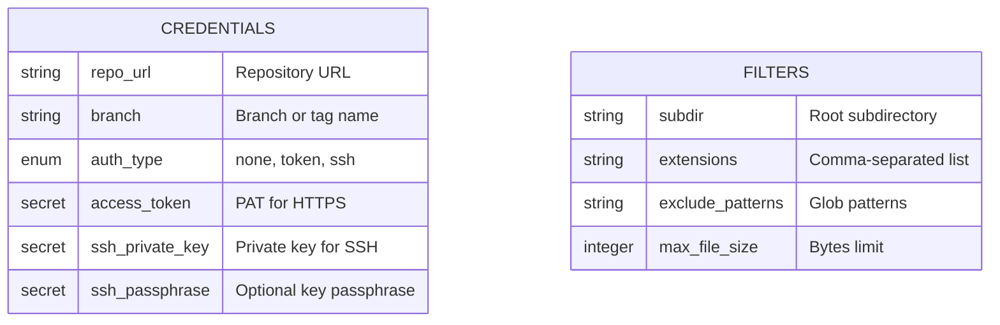

# Git Document Synchronization - Design Document

## Overview

A Dify Data Source plugin enabling Git repositories as first-class document sources for RAG pipelines, with support for incremental synchronization based on commit SHA tracking.

## Goals

Enable Dify Knowledge systems to:

- Ingest documents from Git repositories recursively with initial full synchronization
- Track synchronization state via last synced commit SHA
- Perform incremental updates on subsequent syncs by processing only changed files since last commit
- Remove indexed documents when source files are deleted in Git
- Support multiple Git connection types: HTTP/HTTPS, SSH, and local file paths

## Architecture

### Plugin Type Selection

The plugin implements the `online_drive` datasource type, which provides:

- Hierarchical file and folder navigation
- File content download capabilities
- Built-in pagination support
- Simple two-method contract

**Rationale**: The `online_drive` type matches Git's file hierarchy model better than `online_document` (designed for workspace/page structures like Notion) or `website_crawl` (designed for asynchronous web crawling).

### Core Components



### Data Flow

#### Initial Synchronization



#### Incremental Synchronization



## Data Model

### Document Identification

Each file in the Git repository is identified by a stable ID:

| Component | Description |
|-----------|-------------|
| Repository Hash | First 16 characters of SHA-256 hash of repo URL and authentication identity |
| Reference | Branch, tag, or commit SHA being tracked |
| File Path | Relative path from repository root |

**ID Format**: `{repo_hash}::{ref}::{file_path}`

**Example**: `a1b2c3d4e5f6g7h8::main::docs/architecture/overview.md`

**Rationale**: This format ensures uniqueness across multiple repository configurations while remaining deterministic for updates.

### State Persistence

The plugin uses Dify's persistent storage API (`self.session.storage`) to track synchronization state:

| Key | Value | Purpose |
|-----|-------|---------|
| `git_sync:{config_hash}` | Last synced commit SHA | Enable incremental sync detection |
| `git_config:{config_hash}` | Serialized configuration | Detect configuration changes requiring full resync |

**Configuration Hash**: SHA-256 hash of `{repo_url}:{ref}:{subdir}:{extensions}:{exclude_patterns}`

### File Metadata

Each file entry includes:

| Field | Type | Description |
|-------|------|-------------|
| id | string | Stable document identifier |
| name | string | Human-readable filename |
| size | integer | File size in bytes |
| type | string | Always "file" for documents |
| path | string | Full repository path (in metadata) |
| blob_sha | string | Git blob SHA for change detection |
| last_modified | datetime | Commit time of last change to file |

## Change Detection Strategy

### Synchronization Decision Logic



### Change Classification

| Git Change Type | Action | Document Operation |
|----------------|--------|-------------------|
| Added (A) | Index new file | Create document |
| Modified (M) | Re-index file | Update document |
| Deleted (D) | Remove from index | Delete document |
| Renamed (R) | Delete old + Add new | Delete + Create |

**Rename Handling**: Treated as delete operation on old path followed by add operation on new path, ensuring clean document lifecycle in Dify.

### Full Sync Triggers

Full synchronization occurs when:

- No previous sync state exists (first sync)
- Last synced SHA is unreachable from current HEAD (force push, history rewrite)
- Number of commits between old and current SHA exceeds threshold (default: 1000)
- Repository configuration changed (branch, subdir, filters)

## Authentication and Connectivity

### Supported Authentication Methods

| Method | URL Pattern | Credential Fields | Use Case |
|--------|-------------|------------------|----------|
| Public | `https://...` | None | Public repositories |
| HTTPS Token | `https://...` | `access_token` | Private repos with PAT |
| SSH Key | `git@...` or `ssh://...` | `ssh_private_key`, `ssh_passphrase` | Deploy key access |
| Local Path | `/path/...` or `file://...` | None | Local bare or working tree |

### Credential Configuration Schema



### Security Measures

| Concern | Mitigation |
|---------|-----------|
| Credential exposure in logs | Mask credentials in all log messages and error outputs |
| Credential exposure in URLs | Strip authentication from URLs before logging |
| SSH key files | Create temporary files with 0600 permissions, securely delete after use |
| Token storage | Use Dify's `secret-input` field type for encrypted storage |
| Host key verification | Disable strict checking for SSH (accept any host key) |

## Repository Caching

### Cache Strategy

**Objective**: Minimize network operations by maintaining local repository mirrors.

**Cache Structure**:
```
.git_datasource_cache/
├── {repo_hash_1}/     # Bare repository clone
├── {repo_hash_2}/     # Another repository
└── ...
```

**Cache Operations**:

| Scenario | Action |
|----------|--------|
| First access | Clone repository as bare (no working tree) |
| Subsequent access | Fetch updates from remote |
| Configuration change | Use existing cache if repo URL unchanged |
| Cache corruption | Delete and re-clone |

**Benefits**:
- Reduced clone time on repeated syncs
- Lower network bandwidth usage
- Faster file access (local read)

## File Filtering

### Filter Types

#### Extension Filter

**Purpose**: Include only specific file types for indexing.

**Configuration**: Comma-separated list (e.g., `.md,.txt,.rst`)

**Behavior**:
- Case-insensitive matching
- Automatic dot prefix addition if omitted
- Empty list means accept all extensions

#### Exclude Pattern Filter

**Purpose**: Skip files or directories matching glob patterns.

**Configuration**: Comma-separated glob patterns (e.g., `.*,node_modules,__pycache__`)

**Matching Rules**:
- Match against full path
- Match against individual path components
- Support standard glob wildcards (`*`, `?`, `[...]`)

**Common Patterns**:
- `.*` - Hidden files and directories
- `node_modules` - Node.js dependencies
- `__pycache__` - Python cache
- `*.tmp` - Temporary files

#### Subdirectory Filter

**Purpose**: Limit indexing to specific repository subdirectory.

**Configuration**: Relative path from repository root (e.g., `docs/`)

**Behavior**:
- Only files under specified subdirectory are indexed
- Empty value means repository root
- Non-existent subdirectory results in zero files

#### Size Filter

**Purpose**: Prevent indexing of large files.

**Configuration**: Maximum file size in bytes

**Default**: 1 MB (1048576 bytes)

**Rationale**: Large files may contain binary data or be too large for effective RAG processing.

## Pagination

### Browse Files Pagination

**Dify Contract**:
- `max_keys`: Maximum files per page (default: 20)
- `next_page_parameters`: Opaque state for next page

**Implementation Strategy**:

| Approach | Description | Trade-offs |
|----------|-------------|------------|
| Offset-based | Store offset in `next_page_parameters` | Simple, but inefficient for large result sets |
| Cursor-based | Store last file path as cursor | Efficient, handles sorted results well |

**Selected Approach**: Cursor-based pagination using lexicographically sorted file paths.

**Next Page Parameters Structure**:
```
{
  "cursor": "docs/guide/getting-started.md",
  "total_count": 1500
}
```

## Error Handling

### Error Categories

| Category | Examples | User-Facing Message Pattern |
|----------|----------|----------------------------|
| Credential Errors | Invalid token, SSH key format | "Authentication failed: {masked_reason}" |
| Network Errors | Clone timeout, fetch failure | "Cannot connect to repository: {masked_url}" |
| Git Errors | Invalid ref, corrupted repo | "Git operation failed: {safe_message}" |
| Configuration Errors | Invalid URL, missing required field | "Configuration error: {field_name}" |
| File Errors | File too large, unreadable blob | "Cannot read file {path}: {reason}" |

### Retry Strategy

| Operation | Retry Count | Backoff | Timeout |
|-----------|-------------|---------|---------|
| Clone | 3 | Exponential (1s, 2s, 4s) | 300s per attempt |
| Fetch | 3 | Exponential (1s, 2s, 4s) | 60s per attempt |
| File read | 1 | None | 10s |

### Fallback Behavior

| Failure Scenario | Fallback |
|-----------------|----------|
| Incremental sync fails | Attempt full sync |
| Cache corrupted | Delete cache and re-clone |
| SSH key invalid | Surface clear error, no fallback |
| Ref not found | Try default branch (main/master) |

## Implementation Technology

### Git Library Selection

| Library | Pros | Cons | Recommendation |
|---------|------|------|----------------|
| GitPython | High-level API, mature, fast | Requires git binary | **MVP Phase** |
| Dulwich | Pure Python, portable | Lower-level API, slower | Production hardening |

**Selected**: GitPython for initial implementation due to simpler API and better documentation.

**Migration Path**: Abstract Git operations behind interface to enable Dulwich adoption later.

### Required Dependencies

```
GitPython>=3.1.40
dulwich[paramiko]>=0.21.0  # Optional, for future SSH support
```

## Plugin Structure

```
git-datasource/
├── manifest.yaml                 # Plugin metadata
├── main.py                       # Entry point
├── requirements.txt              # Dependencies
├── _assets/
│   └── icon.svg                 # Plugin icon
├── provider/
│   ├── git_datasource.yaml      # Provider configuration
│   └── git_datasource.py        # Credential validation
├── datasources/
│   ├── git_datasource.yaml      # Datasource configuration
│   └── git_datasource.py        # Main implementation
└── lib/
    ├── git_client.py            # Git operations wrapper
    ├── sync_engine.py           # Sync logic
    ├── file_filters.py          # Filtering logic
    └── state_manager.py         # State persistence
```

## Interface Contracts

### Provider Interface

**Method**: `_validate_credentials(credentials: Mapping[str, Any]) -> None`

**Purpose**: Validate credentials when user configures the data source.

**Validation Steps**:
1. Check required fields based on auth_type
2. Validate URL format
3. Validate SSH key format if provided
4. Perform test connection (ls-remote)
5. Raise `ToolProviderCredentialValidationError` on failure

### DataSource Interface

#### _browse_files

**Signature**:
```
_browse_files(request: OnlineDriveBrowseFilesRequest) -> OnlineDriveBrowseFilesResponse
```

**Request Fields**:
- `bucket`: Not used for Git (always None)
- `prefix`: Directory path to browse
- `max_keys`: Maximum files to return
- `next_page_parameters`: Pagination state

**Response Fields**:
- `result`: List of `OnlineDriveFileBucket`
  - `bucket`: None
  - `files`: List of `OnlineDriveFile`
  - `is_truncated`: Boolean indicating more pages exist
  - `next_page_parameters`: State for next page

**Behavior**:
1. Retrieve or compute current HEAD SHA
2. Compare with last_synced_sha
3. Determine sync type (full, incremental, or none)
4. Apply filters (extensions, exclude patterns, size)
5. Return paginated file list
6. Update last_synced_sha

#### _download_file

**Signature**:
```
_download_file(request: OnlineDriveDownloadFileRequest) -> Generator[DatasourceMessage, None, None]
```

**Request Fields**:
- `bucket`: Not used
- `id`: File identifier (path)

**Response**:
- Yields `DatasourceMessage` containing file blob
- Metadata includes: file_name, mime_type

**Behavior**:
1. Parse file path from request.id
2. Read file content from Git at specific ref
3. Detect MIME type from extension
4. Stream content as blob message

## Operational Considerations

### Performance Limits

| Resource | Default Limit | Purpose |
|----------|--------------|---------|
| Max file size | 1 MB | Prevent memory exhaustion |
| Max files per sync | 10,000 | Bound operation time |
| Max commits for incremental | 1,000 | Force full sync on large gaps |
| Clone timeout | 300 seconds | Prevent indefinite hangs |
| Fetch timeout | 60 seconds | Reasonable for updates |

### Monitoring and Observability

**Logged Events**:
- Sync initiated (type: full/incremental)
- Sync completed (duration, files processed)
- Errors with masked credentials
- Cache operations (clone, fetch, hit/miss)

**Metrics to Track**:
- Sync duration
- Files added/updated/deleted per sync
- Cache hit rate
- Network operation failures

### Edge Cases

| Edge Case | Handling Strategy |
|-----------|------------------|
| Empty repository | Return empty file list, no error |
| No matching files | Return empty list after applying filters |
| Force push detected | Trigger full sync, log warning |
| Branch deleted | Surface error requesting valid ref |
| Submodules encountered | Skip (treat as directories), document limitation |
| Binary files | Allow if under size limit, detect MIME type |
| Symlinks | Skip, document limitation |
| Large repository (>1GB) | Shallow clone with depth=1 for MVP |

## Validation and Testing Strategy

### Feasibility Validation

**Status**: ✅ Validated against dify-plugin-sdks (December 2024)

**Key Confirmations**:
- `online_drive` type contract understood
- `self.session.storage` API available for state persistence
- Credential schema matches Dify requirements
- Similar plugins (Google Cloud Storage) exist as reference

### Test Scenarios

#### Unit Tests
- File filtering logic
- SHA comparison and change detection
- ID generation determinism
- Credential masking

#### Integration Tests
- Clone and fetch operations
- File listing with various filters
- Content download
- State persistence across sessions

#### End-to-End Tests
- Public HTTPS repository
- Private repository with token
- SSH authentication
- Incremental sync after new commits
- Full sync after force push
- Configuration change triggering resync

## Open Questions Resolution

| Question | Resolution |
|----------|-----------|
| State storage mechanism | Use `self.session.storage` API |
| Document deletion on sync | Return only changed files; Dify handles deletion detection |
| Rename handling | Treat as delete + add operations |
| SSH host key verification | Disable strict checking with `-o StrictHostKeyChecking=no` |
| Submodules | Skip in MVP, document as limitation |

## Implementation Phases

### Phase 1: Core Functionality (MVP-1)
**Duration**: 5-7 days

**Deliverables**:
- Plugin structure and manifest
- Public HTTPS repository support
- Basic file listing and content download
- Extension filtering
- Local cache implementation

**Success Criteria**: Can index public repository with markdown files

### Phase 2: Authentication (MVP-2)
**Duration**: 3-5 days

**Deliverables**:
- HTTPS token authentication
- SSH key authentication
- Credential validation
- Secure temporary file handling

**Success Criteria**: Can access private repositories via token and SSH

### Phase 3: Incremental Sync (MVP-3)
**Duration**: 5-7 days

**Deliverables**:
- State persistence using session.storage
- Change detection (diff between commits)
- Incremental file processing
- Full sync fallback logic

**Success Criteria**: Only processes changed files on subsequent syncs

### Phase 4: Hardening (MVP-4)
**Duration**: 3-5 days

**Deliverables**:
- Pagination implementation
- Size and count limits
- Error handling and retry logic
- Logging and observability
- Documentation

**Success Criteria**: Handles edge cases gracefully, provides clear errors

**Total Estimated Duration**: 16-24 days

## Success Metrics

| Metric | Target |
|--------|--------|
| Time to first sync (public repo) | < 30 seconds |
| Incremental sync time (10 changed files) | < 5 seconds |
| Memory usage | < 256 MB |
| Supported repository size | Up to 10,000 files |
| Authentication methods | 3 (public, token, SSH) |

## Risks and Mitigations

| Risk | Impact | Mitigation |
|------|--------|-----------|
| Git binary not available in Dify runtime | High | Use Dulwich as fallback |
| Large repositories exhaust memory | Medium | Implement size/count limits, shallow clone |
| SSH key management complexity | Medium | Comprehensive documentation, validate key format |
| Network timeouts on slow connections | Low | Configurable timeouts, retry logic |
| Dify session.storage limitations | Medium | Document storage requirements, handle quota errors |

## Dependencies and References

**Dify Plugin SDK**:
- Repository: https://github.com/langgenius/dify-plugin-sdks
- Documentation: dify-plugin-sdks/python/
- Reference Plugin: google_cloud_storage (online_drive example)

**Git Libraries**:
- GitPython: https://gitpython.readthedocs.io/
- Dulwich: https://www.dulwich.io/docs/

**Project Documentation**:
- Feasibility Analysis: `/reference/FEASIBILITY_ANALYSIS.md`
- Dify Plugin Guide: `/reference/dify/datasource_plugin_guide.md`
- Git Library Guides: `/reference/git/gitpython_guide.md`, `/reference/git/dulwich_guide.md`
- Code Examples: `/reference/git/examples/`
- Patterns: `/reference/patterns/incremental_sync.md`, `/reference/patterns/credential_handling.md`
